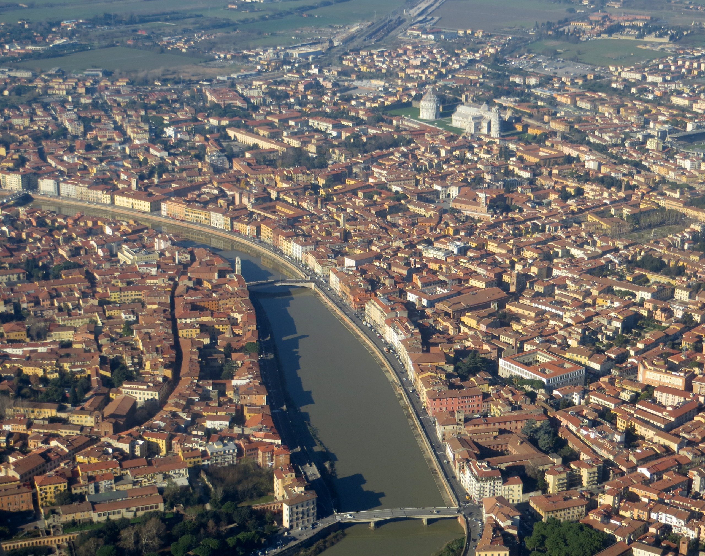
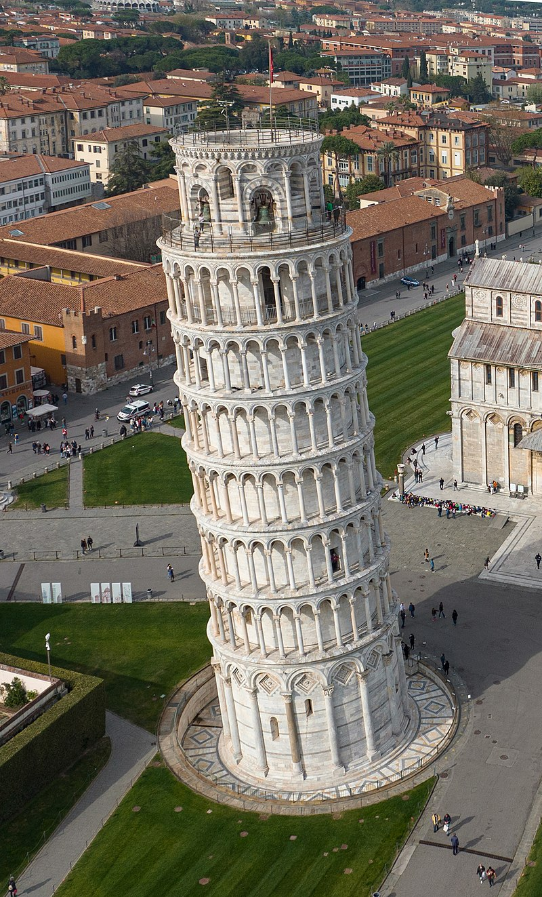

<iframe src="https://www.google.com/maps/embed?pb=!1m18!1m12!1m3!1d2883.526313996286!2d10.408278499999998!3d43.720392200000006!2m3!1f0!2f0!3f0!3m2!1i1024!2i768!4f13.1!3m3!1m2!1s0x12d591bcbfe591bb%3A0x91d311f58e2115b6!2sDepartment%20of%20Computer%20Science!5e0!3m2!1sen!2sit!4v1678265321943!5m2!1sen!2sit" width="600" height="450" style="border:0;" allowfullscreen="" loading="lazy" referrerpolicy="no-referrer-when-downgrade"></iframe>

# Address

<address>
Dipartimento di Informatica

Università di Pisa
Largo B. Pontecorvo, 3
56127 Pisa
</address>
# Website 
[Department of Computer Science, University of Pisa](https://www.di.unipi.it/en) -- [Directions](https://goo.gl/maps/yiL4z8wyM1h58AxE7)

# About Pisa
{: width="450"}
{:style="text-align:center;"}

Pisa is a charming city in Tuscany, Italy, located on the banks of the Arno River. The city has a rich history that dates back to the Etruscan period and has been a centre of art, culture, and commerce for centuries. 

Pisa is best known for its iconic Leaning Tower, but it also boasts a wealth of other notable architectural marvels, such as the Piazza dei Miracoli (also known as the Square of Miracles). This UNESCO World Heritage Site includes the Cathedral of Santa Maria Assunta, the Baptistery, and the Camposanto Monumentale. The square is a masterpiece of medieval architecture and is one of the most visited tourist attractions in Italy.

{: width="250"}
{:style="text-align:center;"}

Visitors to Pisa can explore the city's narrow streets, charming piazzas, and vibrant markets, where they can sample local delicacies and indulge in authentic Italian cuisine. The city is also home to many museums and art galleries, such as the Museo di San Matteo, which houses a collection of medieval and Renaissance art, and the Museo Nazionale di Palazzo Reale, which showcases the history of the city and the region.

Pisa has a strong scientific legacy, and it is the birthplace of Galileo Galilei, the famous scientist who made groundbreaking discoveries in the fields of astronomy, physics, and mathematics.  Pisa is also home to one of the oldest universities in Europe, the University of Pisa, which was founded in 1343 and has a long history of excellence in education and research.

{: width="250"}
{:style="text-align:center;"}

In addition to its cultural and scientific attractions, Pisa is also a gateway to the beautiful region of Tuscany. Visitors can take day trips to nearby cities such as Florence, Lucca, and Siena, which offer stunning architecture, art, and cuisine.

Whether you are a history buff, an architecture enthusiast, a foodie, or a scientist, Pisa has something to offer everyone. It is a city steeped in history, culture, and innovation, and it offers visitors a unique and unforgettable experience in the heart of Tuscany.